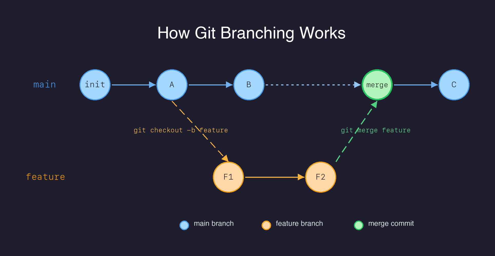
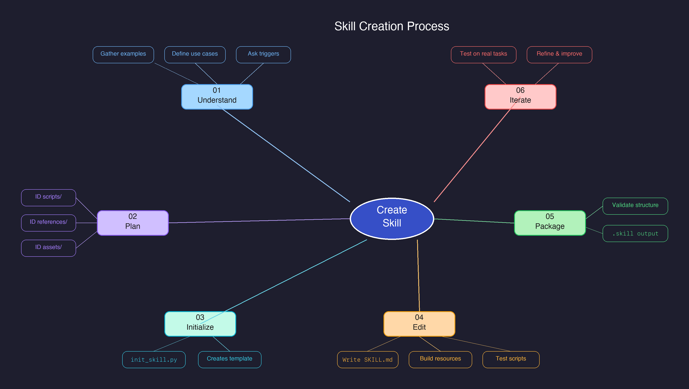

# Visualize Skill for Claude Code

A Claude Code skill that generates educational diagrams as Excalidraw JSON (`.excalidraw`) and PNG files.

## What It Does

Transforms concepts into visual diagrams — flowcharts, mind maps, comparisons, hierarchies, timelines, and cycle diagrams. Each diagram teaches through structure, not decoration.

## Diagram Types

| Request | Type |
|---------|------|
| Process, workflow | Flowchart |
| Brainstorm, topic overview | Mind Map |
| "X vs Y", tradeoffs | Comparison |
| Categories, taxonomy | Hierarchy |
| Repeating process | Cycle |
| Steps over time | Timeline |

## Installation

1. Copy the `skill/` directory to `~/.claude/skills/visualize/`
2. Or install the packaged `visualize.skill` file

## Usage

Trigger with `/visualize` or natural language:
- "Draw a flowchart of the CI/CD pipeline"
- "Create a mind map of React concepts"
- "Visualize how authentication works"

## Quality Checks

The skill includes `validate_layout.py` that checks for:
- Shape-shape overlaps (boxes too close or overlapping)
- Line-through-shape collisions (arrows passing through unrelated shapes)
- Text-shape overlaps
- Arrow-arrow overlaps (lines running on top of each other)

```bash
python3 skill/scripts/validate_layout.py diagram.excalidraw --min-gap 20
```

## Examples

### Git Branching Diagram


### Skill Creation Mind Map


## File Structure

```
skill/
├── SKILL.md                          # Skill definition and workflow
├── scripts/
│   ├── render_excalidraw.py          # Pillow-based PNG renderer
│   └── validate_layout.py           # Layout quality checker
└── references/
    ├── excalidraw-schema.md          # Excalidraw JSON schema reference
    └── diagram-patterns.md           # Layout patterns and examples
```

## Output Formats

- `.excalidraw` — editable at [excalidraw.com](https://excalidraw.com) or in VS Code
- `.png` — rendered at 2x (retina) quality
